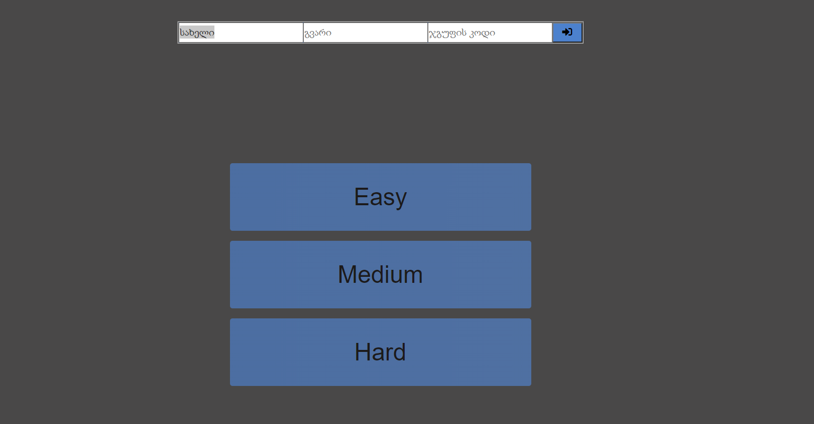
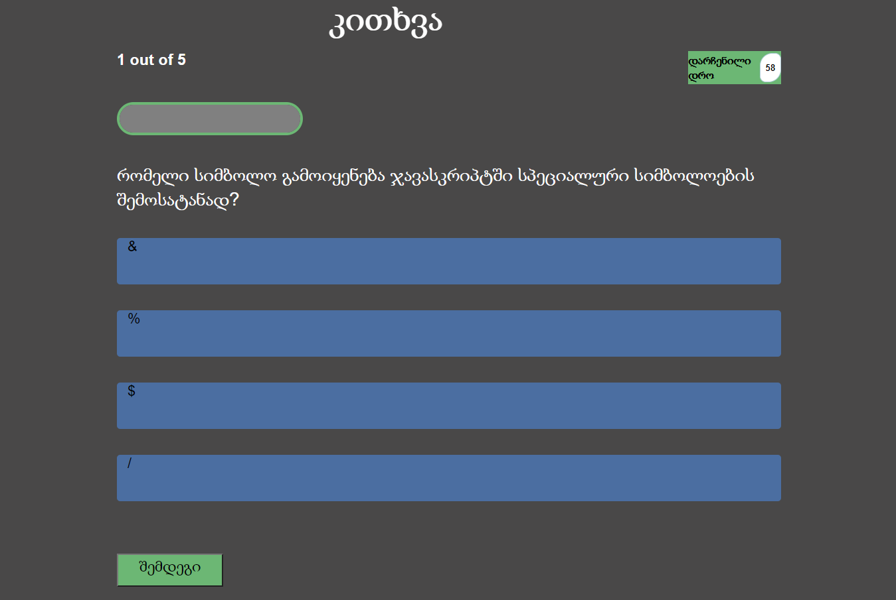
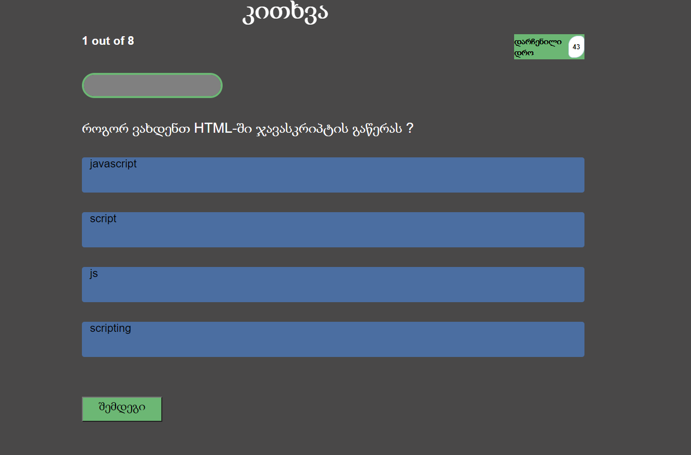
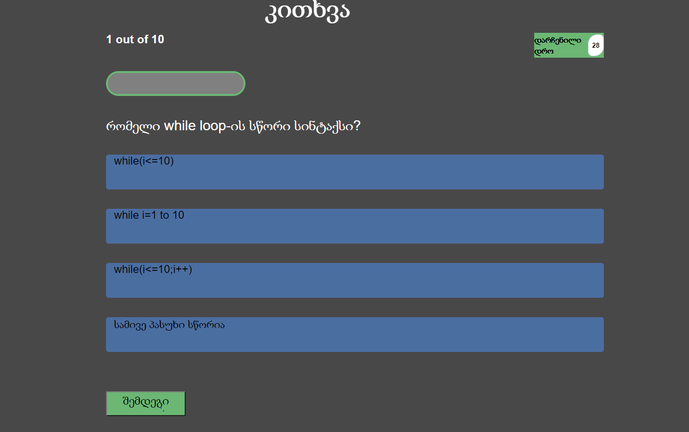
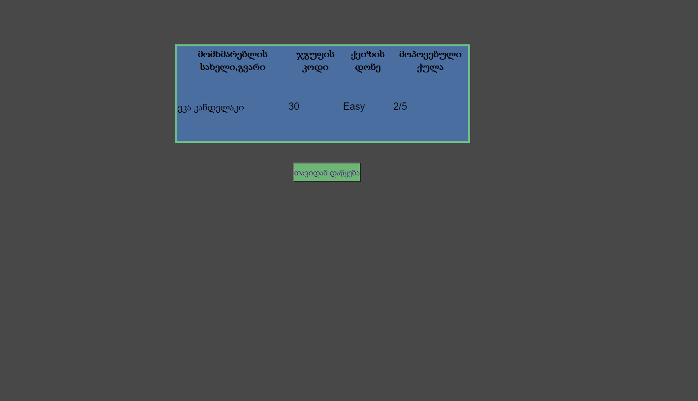

# readme-file-project

##ქვიზის აპლიკაცია

მოცემული გვაქვს ქვიზის აპლიკაცია, რომელიც ითხოვს ავტორიზაციას და გვთავაზობს სამი სხვადასხვა სირთულის ჯავასკრიპტის ტესტს.

-მარტივი ტესტი

-საშუალო ტესტი

-რთული ტესტი

ქვიზს გააჩნია ტაიმერი და ასევე პროგრესს ბარი, რომელიც გვიჩვენებს რომელ კითხვაზე ვიმყოფებით საერთო კითხვების რაოდენობასთან მიმართებაში.

მარტივი ტესტის შემთხვევაში, დრო 60 წამია. დროის ამოწურვის შემდეგ ავტომატურად გადადის შემდეგ კითხვაზე.კითხვების რაოდენობა არის 5, სწორად გაცემული პასუხი ფასდება 1 ქულით.

საშუალო ტესტის შემთხვევაში, დრო 45 წამია. დროის ამოწურვის შემდეგ ავტომატურად გადადის შემდეგ კითხვაზე.კითხვების რაოდენობა არის 8, სწორად გაცემული პასუხი ფასდება 2 ქულით.

რთული ტესტის შემთხვევაში, დრო 30 წამია. დროის ამოწურვის შემდეგ ავტომატურად გადადის შემდეგ კითხვაზე.კითხვების რაოდენობა არის 10, სწორად გაცემული პასუხი ფასდება 3 ქულით.

ქვიზის დასასრულს  გვაქვს ლიდერბორდი, რომელიც გვიჩვენებს მომხმარებლის სახელს, გვარს, ქვიზის დონეს და ქულას.გვაქვს ასევე ღილაკი ქვიზის ხელახლა დაწყებისთვის.

პროექტში გამოყენებული თულებია:

[ფონტები შემოვიტანე](https://web-fonts.ge)
[აიქონები შემოვიტანე](https://fontawesome.com)
